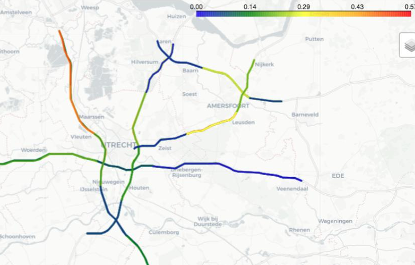

# RWS Accident Prediction
This project aims to predict the probability of road accidents within a certain time window and space granularity for the Utrecht region of the Netherlands. The model predicts for example, at 9 AM, the likelihood of accident for road sections across the highway network between 9 AM to 10 AM. Both the time window can be configured and the road segment size as required by the partner. 

## Deliverable

The main deliverable of this project is a heatmap displaying the probability of accidents over road segments on the highway network as well as an ordered list of road segments and their respective likelihood scores. This visualization and map can be used by traffic managers to allocate traffic inspectors to certain road sections. The code here is used to generate the heatmaps using a static historical data set. Before deployment our project partner Rijkswaterstaat (RWS), would first need to take this project and perform a pilot study to validate our predictions, before deploying into existing systems. This deployment would require real-time data streaming of live speed, flow and weather data. 

## Documentation
For detailed documentation visit the <a href="https://github.com/dssg/rws_accident_prediction/wiki" target="_blank"> **project wiki page** </a>.

## Prerequisites:
This project requires the following to run the model. Data exploration was performed using Jupyter Notebooks, and data extract, transform, and load done using SQL. To rerun the pipeline the following are required:
* Machine - experimental setup
	* Operating system: Ubuntu 16.04.4 LTS (Xenial Xerus).
	* CPU: Intel(R) Xeon(R) CPU E5-2686 v4 @ 2.30GHz
	* RAM: 16GB
* `Anaconda Python 3.6` to run modelling pipeline
* Anaconda environment generated from `requirements.yml`
* `PostgreSQL 9.6` database backend for data storage.
* Working `db_config.json` with credentials

## Getting started:
The main project folders are described here:
* `database/` bash and sql scripts for copying data to datbase and cleaning
* `src/` includes source code for pipeline, feature analysis, data wrangling for visualizations.
	* `src/data` code used to generate features and create spine
    * `src/evaluation` generate precision recall at percentage of population evaluation curves 
    * `src/experiment_config` configuration files for experiments defining: features, segmentation, time window, and lag
    * `src/models` runs training loop
    * `src/utils` utility functions for tasks such as connecting to database, and reading and writing results
    * `src/visualization`  generates pdf report, and heatmap to visualize experimental results
* `notebooks/` includes jupyter notebooks for data exploration and initial data exploration and descriptive statistics
* `images/` for presentation purposes.

###### Directory structure
```
rws_accident_prediction/
├── database
│   ├── <etl_scripts.sql>
│   └── <etl_scripts.sh>
├── images
│   └── <images.png>
├── notebooks
│   ├── playground
│   │   └── <eda.ipynb>
│   ├── tableau
│   │   └── <dashboards.twb>
│   └── <eda.ipynb>
├── readings
│       └── <articles.pdf>
└── src
    ├── data
    │   └── temp_files
    ├── evaluation
    │   ├ <evaluate.py>
    │   └ <generateEvaluation.py>
    ├── experiment_config
    │   └ <config.yaml>
    ├── models
    │   ├ <train.py>
    │   ├ <BaseliineClassifier.py>
    │   └ <feature_impact_review.py>
    ├── utils
    │   ├ <misc_utils.py>
    │   ├ <orchestra_utils.py>
    │   ├ <read_exp_utils.py>
    │   └ <write_exp_utils.py>
    ├── visualization
    │   ├── images
    │   │   └── <experiment_plots.png>
    │   ├ <report_generator.py>
    │   └ <visualize.py>    
    │   └── <create_accident_prediction_pap.ipynb>
    └ <create_experiment.py>
```

### Installation guide

#### Installing git and forking the repo

Fork a copy of this repository onto your own GitHub account and `clone` your fork of the repository onto your computer, inside your favorite folder, using:

`git clone https://github.com/dssg/rws_accident_prediction.git`


#### Installing python and setting up the environment

[Install Python 3.6](https://www.python.org/downloads/release/python-360/) and the [conda package manager](https://conda.io/miniconda.html) (use miniconda, not anaconda, because we will install all the packages we need).
Navigate to the project directory inside a terminal and create a virtual environment (replace <environment_name>, for example, with "dssg_rws") and install the [required packages](https://github.com/dssg/rws_accident_prediction/blob/dev/requirements.yml):

`conda create -n <environment_name> --file requirements.yml python=3.6`

Activate the virtual environment:

`source activate <environment_name>`

By installing these packages in a virtual environment, we avoid dependency clashes with other packages that may already be installed elsewhere on your computer.


## Authors
This project was conducted as part of <a href="https://dssg.uchicago.edu/europe/" target="_blank">Data Science for Social Good (DSSG)</a> Europe 2018 fellowship.

**Data science fellows:** Anne Driscoll, Can Udomcharoenchaikit, Harsh Nisar, and Indu Manickam 

**Project Manager**: Gabriele Simeone

**Technical Mentor**: William Grimes

## Acknowledgements:
We would like to acknowledge all of the hard work of our partners, data providers, and mentors. In particular:

**Rijkswaterstaat (RWS):** John Steenbruggen, Arjan Knol, and Fred van der Zeeuw 

**CS Research:** Euro Beinat, Günther Sagl, Bas Hermans  and Pavlos Kazakopoulos

In addition, we would also like to extend our gratitude to _Nova School of Business and Economics_ for providing an environment to make this project possible, and _Amazon Web Services_ for computing and research credits. 

## Disclaimer
*All analysis and opinions contained here are the authors’ own, and are not necessarily held or endorsed by any of the partners or data-providing agencies.*

## License
This project is licensed under the MIT License - see the LICENSE.md file for details
